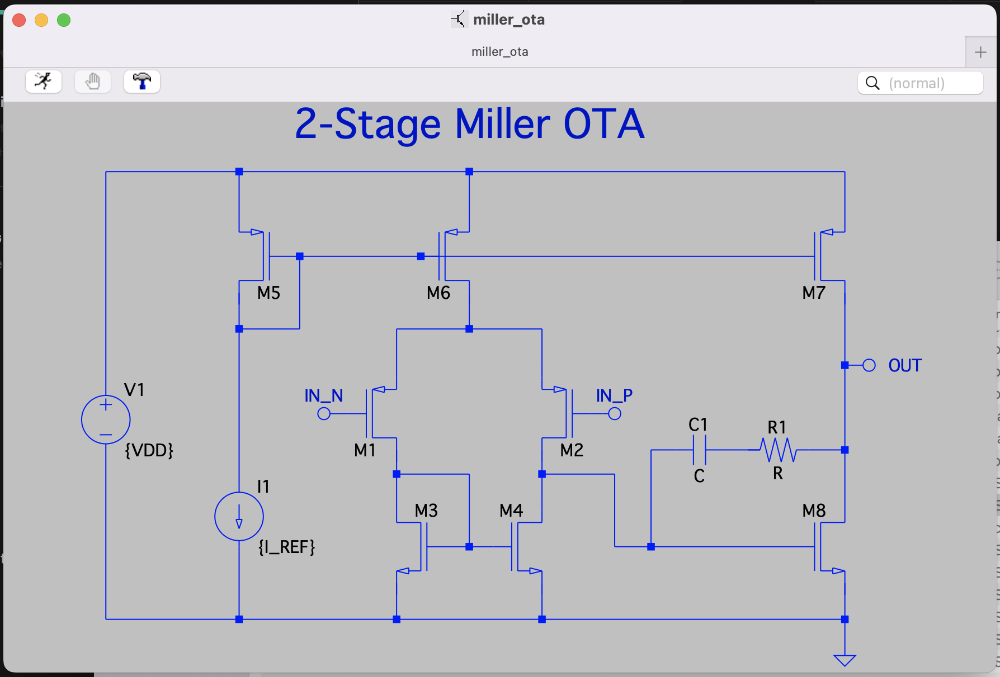

# LTspice to SVG Converter

A Python tool to convert LTspice schematic files (.asc) into SVG format. This tool preserves the layout, components, wires, and text elements from your LTspice schematics while providing configurable styling options.

## Features

- Converts LTspice schematics (.asc) to SVG format
- Supports all standard LTspice components:
  - Basic components (NMOS, PMOS, resistors, capacitors)
  - Power and ground symbols (VDD, GND)
  - Pin/port symbols with connection dots
- Handles component rotations (R0, R90, R180, R270) and mirroring (M0, M90, M180, M270)
- Preserves wire connections and adds T-junction dots
- Maintains text elements with proper alignment (labels, values, comments)
- Configurable styling (stroke width, scale, font size)
- Exports intermediate JSON data for debugging

## Installation

1. Clone the repository:
```bash
git clone https://github.com/yourusername/ltspice_to_svg.git
cd ltspice_to_svg
```

2. Create and activate a virtual environment:
```bash
python -m venv venv
source venv/bin/activate  # On Windows: venv\Scripts\activate
```

3. Install dependencies:
```bash
pip install -r requirements.txt
```

## Usage

### Basic Usage

Convert a schematic file to SVG:
```bash
python src/ltspice_to_svg.py path/to/schematic.asc
```

The SVG file will be generated in the same directory as the input file.

The schematic:



The generated SVG:


### Advanced Options

```bash
python src/ltspice_to_svg.py path/to/schematic.asc [options]
```

Available options:
- `--stroke-width WIDTH`: Line width in SVG (default: 4.0)
- `--dot-size SIZE`: Size of junction dots relative to stroke width (default: 1.5)
- `--scale SCALE`: Scale factor for coordinates (default: 1.0)
- `--font-size SIZE`: Font size in pixels before scaling (default: 22.0)
- `--export-json`: Export intermediate JSON files for debugging

### Example

Let's convert a Miller OTA (Operational Transconductance Amplifier) schematic:
```bash
python src/ltspice_to_svg.py schematics/miller_ota.asc --stroke-width 2.0 --scale 0.2
```

This will convert the following schematic:
```
Version 4
SHEET 1 1208 692
WIRE 272 16 -32 16
WIRE 768 16 768 -32
...
SYMBOL PMOS 208 128 R0
SYMATTR InstName X2
SYMBOL PMOS 32 128 M0
SYMATTR InstName X6
...
TEXT 184 336 Left 2 ;M1
TEXT 328 336 Left 2 ;M2
TEXT 560 344 Left 2 ;Cc
TEXT 664 344 Left 2 ;Rc
...
```

The converter will:
1. Parse the schematic file to extract:
   - 42 wires with their coordinates
   - 16 symbols (transistors, pins, power/ground)
   - 14 text elements (labels and comments)
2. Load and parse symbol files (NMOS.asy, PMOS.asy, etc.)
3. Detect T-junctions where 3 or more wires meet
4. Generate an SVG file with:
   - Properly scaled and positioned components
   - Wire connections with T-junction dots
   - Rotated and mirrored symbols as needed
   - Text labels in correct positions
   - Pin connection dots

## File Format Support

### Input Files
- `.asc`: LTspice schematic files
- `.asy`: LTspice symbol files (automatically loaded for components)

### Output Files
- `.svg`: Vector graphics output
- `_schematic.json`: Parsed schematic data (with --export-json)
- `_symbol.json`: Parsed symbol data (with --export-json)
- `_debug.json`: Debug information (with --export-json)

## Development

### Running Tests

```bash
python -m pytest tests/
```

### Project Structure

```
ltspice_to_svg/
├── src/
│   ├── parsers/
│   │   ├── asc_parser.py    # Parses .asc schematic files
│   │   └── asy_parser.py    # Parses .asy symbol files
│   ├── generators/
│   │   └── svg_generator.py # Generates SVG output
│   └── ltspice_to_svg.py    # Main script
├── tests/
│   └── test_ltspice_to_svg.py
├── schematics/             # Example schematics
│   ├── miller_ota.asc
│   ├── NMOS.asy
│   ├── PMOS.asy
│   └── ...
└── requirements.txt
```

## Contributing

1. Fork the repository
2. Create a feature branch
3. Make your changes
4. Run tests
5. Submit a pull request

## License

This project is licensed under the MIT License - see the LICENSE file for details.

## Acknowledgments

- Built with [svgwrite](https://github.com/mozman/svgwrite)
- Inspired by LTspice from Analog Devices
